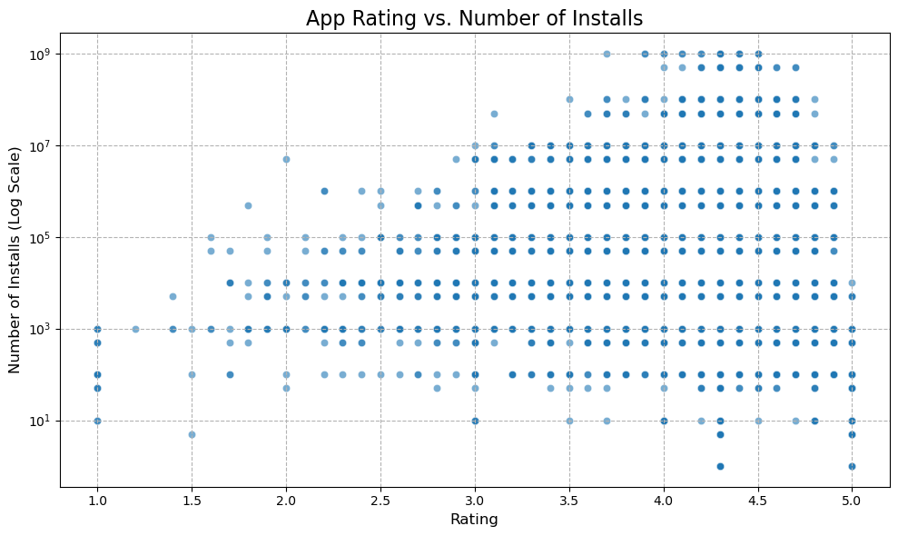
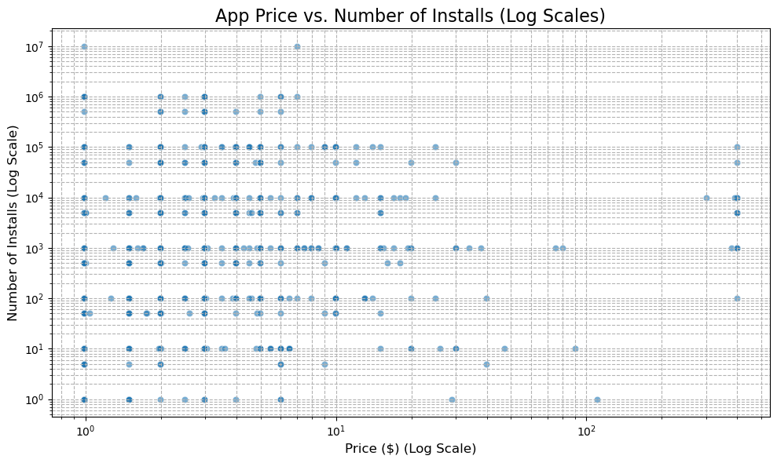
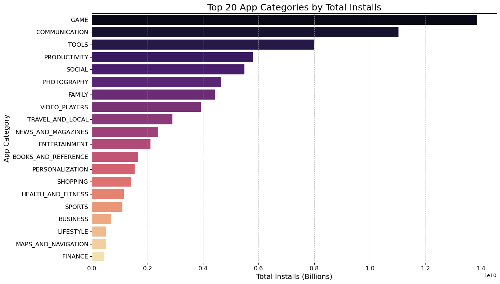

# Google Play App Store Data Analysis: Driving Growth & Retention Strategies

## Table of Contents
1.  [Introduction](#1-introduction)
2.  [Data Description](#3-data-description)
3.  [Data Loading & Initial Cleaning](#4-data-loading--initial-cleaning)
4.  [Analysis & Insights](#5-analysis--insights)
    * [5.1. Initial Correlations with Installs](#51-initial-correlations-with-installs)
    * [5.2. Category-Specific Performance](#52-category-specific-performance)
    * [5.3. Top-Performing Apps](#53-top-performing-apps)
    * [5.4. Content Rating Impact on Installs](#54-content-rating-impact-on-installs)
5.  [Consolidated Strategies for Growth & Retention](#6-consolidated-strategies-for-growth--retention)
6.  [Conclusion & Next Steps](#7-conclusion--next-steps)


## 1. Introduction

This repository contains the analysis of Google Play app store data aimed at identifying key insights to devise effective strategies for driving app growth (user acquisition) and retention (user engagement & satisfaction). I explored various app characteristics, category performance, and market segmentation to understand what contributes to app success.

## Data Files:
The analysis utilizes two `.xls` files (which are treated as CSVs due to how they were saved):

`apps_saved.xls:` Contains detailed information about various apps.

`user_reviews_saved.xls:` Contains user reviews and their sentiment.

## Data Description
This section describes the datasets used in this analysis, outlining the columns and their respective meanings.

`apps_saved.xls` (Apps Informations)
This dataset contains comprehensive details for each app listed in the store.

| Column Name     | Description                                                          |
| :-------------- | :------------------------------------------------------------------- |
| `App`           | The name of the application.                                         |
| `Category`      | The category to which the app belongs (e.g., GAME, COMMUNICATION). |
| `Rating`        | The average user rating of the app (on a 5-point scale).           |
| `Reviews`       | The number of user reviews for the app.                              |
| `Size`          | The size of the app in megabytes (MB).                               |
| `Installs`      | The estimated number of times the app has been installed.            |
| `Type`          | Indicates if the app is 'Free' or 'Paid'.                            |
| `Price`         | The price of the app in US dollars ($).                              |
| `Content Rating`| The target age group for the app (e.g., Everyone, Teen, Mature 17+). |
| `Genres`        | The specific genre(s) of the app.                                    |
| `Last Updated`  | The date when the app was last updated.                              |
| `Current Ver`   | The current version of the app.                                      |
| `Android Ver`   | The minimum Android version required to run the app.                 |

`user_reviews_saved.xls` (User Reviews)
This dataset contains user comments and a sentiment analysis of each review.

| Column Name     | Description                                                          |
| :-------------- | :------------------------------------------------------------------- |
| `App`           | The name of the application the review is for.                       |
| `Translated_Review`| The user's review text, potentially translated.                     |
| `Sentiment`     | The sentiment of the review (Positive, Negative, or Neutral).        |
| `Sentiment_Polarity`| A numerical score representing the positivity of the sentiment (-1 to 1).|
| `Sentiment_Subjectivity`| A numerical score representing the subjectivity of the review (0 to 1).|


## Data Loading & Initial Cleaning

The first step involved loading the datasets and performing comprehensive cleaning to ensure data quality and usability for analysis. This included handling missing values, converting data types, and cleaning inconsistent entries.

### Key Cleaning Steps (applied to apps_df primarily):

- Dropping irrelevant columns (e.g., 'Unnamed: 0').
- Converting 'Installs' and 'Reviews' to numeric (integer) by removing '+', ',', and handling NaNs.
- Converting 'Price' to numeric (float) by removing '$' and handling NaNs.
- Filling missing 'Rating' values with the median.
- Filling missing 'Size' values with the median after converting to numeric.
- Filling missing 'Current Ver' and 'Android Ver' with their respective modes.

```import pandas as pd
import matplotlib.pyplot as plt
import seaborn as sns

# Load datasets
apps_df = pd.read_csv('apps_saved.xls')
reviews_df = pd.read_csv('user_reviews_saved.xls')

# --- Example of cleaning 'Installs' and 'Price' ---
apps_df['Installs'] = apps_df['Installs'].astype(str).str.replace('+', '').str.replace(',', '')
apps_df['Installs'] = pd.to_numeric(apps_df['Installs'], errors='coerce').fillna(0).astype(int)

apps_df['Price'] = apps_df['Price'].astype(str).str.replace('$', '')
apps_df['Price'] = pd.to_numeric(apps_df['Price'], errors='coerce').fillna(0.0)

# (Other cleaning steps as described in the notebook)

```


## Analysis & Insights
I conducted several analyses to uncover factors influencing app growth and retention.

**1. Initial Correlations with Installs**
- Objective: To understand if simple linear relationships exist between app characteristics (Rating, Size, Price) and the number of installs.
- Methodology: Calculated Pearson correlation coefficients between 'Rating', 'Size', 'Price', and 'Installs' in apps_df.

### Key Findings:

- Very Weak Linear Correlations: All correlations (Rating vs. Installs, Size vs. Installs, Price vs. Installs) were very close to zero (e.g., Rating: 0.034, Size: 0.031, Price: -0.009).

- Implication: Simple linear dependencies on these metrics are not strong primary drivers of growth in this dataset. Success is likely more complex, involving multiple factors or non-linear relationships.






**2. Category-Specific Performance**
- Objective: To identify which app categories demonstrate the highest user demand and their general characteristics.
- Methodology: Grouped apps_df by 'Category' and calculated the total 'Installs', average 'Rating', average 'Size', and average 'Price' for each category.

### Key Findings:

- **Dominant Categories: GAME and COMMUNICATION** categories lead significantly in total installs (13.8B and 11.0B respectively), followed by TOOLS (8.0B) and PRODUCTIVITY (5.8B).
- **Consistent Ratings:** Average ratings across most top categories consistently hover between **4.1 and 4.3.**
- **Size Variation: Games** tend to be larger **(avg. 39MB),** while **Communication and Tools app**s are smaller **(avg. ~10-12MB).**
- **Pricing Trend:** High-install categories generally have very low average prices **($0.02 - $0.67)**, reflecting the prevalence of free apps.



**3. Top-Performing Apps**
- Objective: To analyze the specific characteristics of apps that achieve either massive installs or exceptionally high user ratings.
- Methodology:
    - Identified the top 10 apps by 'Installs'.
    - Identified the top 10 apps by 'Rating', applying a filter for a minimum of 10,000 reviews to ensure rating robustness.

### Key Findings:

- **Top by Installs (1 Billion+):** These are largely core utility **(e.g., Maps, Chrome, Gmail)**, communication **(WhatsApp, Facebook)**, and major entertainment **(YouTube, Subway Surfers)** apps. They are almost exclusively free and often benefit from strong brand recognition.

- **Top by Rating (4.9 with many reviews):** These apps are more diverse, spanning niche categories like **Education, Health & Fitness, Beauty, and specialized tools.** They demonstrate exceptional user satisfaction and highlight that quality and meeting specific user needs are crucial, even if not reaching billions of installs. Some top-rated apps are paid, indicating users will pay for perceived high value.

**4. Content Rating Impact on Installs**
- Objective: To determine how an app's content rating (target audience) influences its overall popularity.
- Methodology: Grouped apps_df by 'Content Rating' and calculated total 'Installs' and average 'Rating'.

### Key Findings:

- **"Everyone" Dominance:** Apps rated "Everyone" account for the overwhelming majority of installs (over 52 billion), demonstrating the highest potential for mass user acquisition.

- **"Teen" Significance:** The "Teen" content rating also represents a substantial market with over 16 billion installs.

- **Niche Quality:** While smaller in install volume, ratings for "Mature 17+" and "Adults only 18+" apps maintain good average ratings, suggesting success within specialized audiences.


**5. Consolidated Strategies for Growth & Retention**
Based on the insights derived from this analysis, here's a consolidated set of strategies:

- **Strategies for Growth (User Acquisition):**
Prioritize Mass-Market Categories: Focus app development and marketing on categories with proven, immense demand such as Games, Communication, Tools, and Productivity.

- **Adopt a Free-to-Download Model:** For maximizing user acquisition and achieving widespread reach, a free pricing model is paramount. Monetization can be achieved through in-app purchases, ads, or premium features.

- **Target the Broadest Audience ("Everyone"):** Design apps that are suitable for and can be rated "Everyone" to tap into the largest possible user base and maximize install potential. The "Teen" audience also represents a significant growth segment.

- **Optimize App Size (Generally):** For most utility and communication apps, maintaining a relatively small app size can improve download rates, especially in regions with slower internet or limited storage. Games may be an exception where users tolerate larger sizes for richer experiences.

- **Focus on Strong Value Proposition:** Even without a dominant brand, a clear and compelling value proposition that addresses broad user needs can drive initial adoption.

### Strategies for Retention (User Engagement & Satisfaction):

- **Obsess Over Quality and User Experience:** Regardless of category or target audience, delivering an exceptional user experience is the cornerstone of high ratings and long-term user retention. This includes intuitive design, reliable performance, and valuable features.

-**Identify and Serve Niche Needs Exceptionally Well:** For apps not aiming for billions of installs, finding and excelling in a specific niche can lead to highly engaged and satisfied users, resulting in strong retention and positive word-of-mouth.

- **Maintain High Ratings:** Continuously strive for a 4.0+ rating by listening to user feedback and iteratively improving the app. High ratings build trust and are crucial for retention.

- **Justify Paid Models with Superior Value:** If opting for a paid app, ensure the product offers distinctive and superior value that users are clearly willing to pay for, as demonstrated by some of the highly-rated paid apps.

**6. Conclusion & Next Steps**

This analysis provides a strong foundation for understanding key drivers of app success in the app store. While simple linear correlations are not strong, the aggregate performance of categories and the characteristics of top-performing apps offer clear strategic directions.

**Further exploration could include:**

- In-depth qualitative analysis of reviews for highly-rated vs. low-rated apps to understand specific user pain points or delight factors.

- Time-series analysis if release dates and update frequencies were available, to see impact on installs/ratings.

- Analysis of specific monetization strategies (e.g., IAP, subscription) within different categories.

